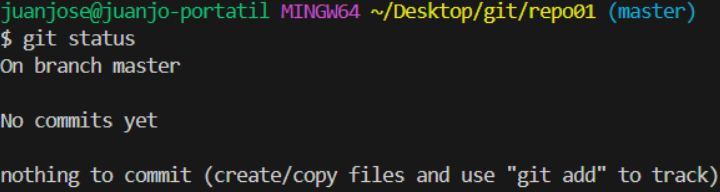
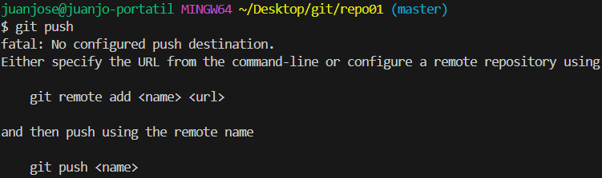
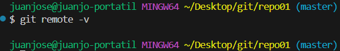
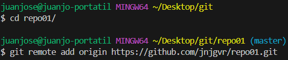
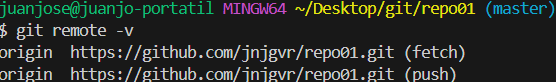
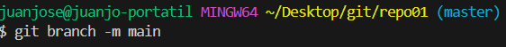
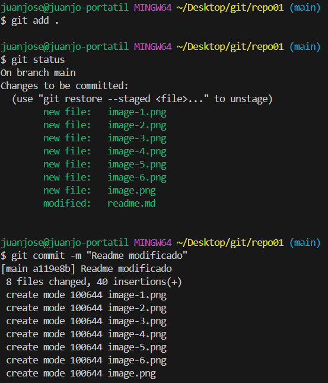

- [EJERCICIO 1](#ejercicio-1)
  - [1.1 Crear el repositorio local:](#11-crear-el-repositorio-local)
  - [1.2 Crear y editar archivo readme.md](#12-crear-y-editar-archivo-readmemd)
  - [1.3 Añadir el fichero al staging area](#13-añadir-el-fichero-al-staging-area)
  - [1.4 Subir los ficheros al repositorio remoto](#14-subir-los-ficheros-al-repositorio-remoto)
  - [1.5 git remote -v](#15-git-remote--v)
  - [1.6 Asiocando repositorios locales y remotos](#16-asiocando-repositorios-locales-y-remotos)
  - [1.7 Probando los repositorios remotos asociados](#17-probando-los-repositorios-remotos-asociados)
  - [1.8 Subir los cambios en el repositorio remoto](#18-subir-los-cambios-en-el-repositorio-remoto)
  - [1.9 Resultados en repositorio remoto](#19-resultados-en-repositorio-remoto)

# EJERCICIO 1
## 1.1 Crear el repositorio local:
```
mkdir repo01
git init repo01
git status
```

## 1.2 Crear y editar archivo readme.md
```
touch readme.md
```
## 1.3 Añadir el fichero al staging area
```
git add .
git status
git commit -m
```
  

__¿En que__ ___"file status lifecycle"___ __se encuentra el fichero?__  
Commited
## 1.4 Subir los ficheros al repositorio remoto
  Esta intentando subir los ficheros a un repositorio remoto, pero todavia no tengo ninguno configurado para el local, por tanto no tiene donde subirlo.

## 1.5 git remote -v
  
No conseguimos una respuesta porque no tenemos definido ningun repositorio remoto para este repositorio local.
## 1.6 Asiocando repositorios locales y remotos

## 1.7 Probando los repositorios remotos asociados
  
Ahora funciona correctamente dado que tiene un origen definido gracias al comando del paso anterior.
## 1.8 Subir los cambios en el repositorio remoto


## 1.9 Resultados en repositorio remoto
